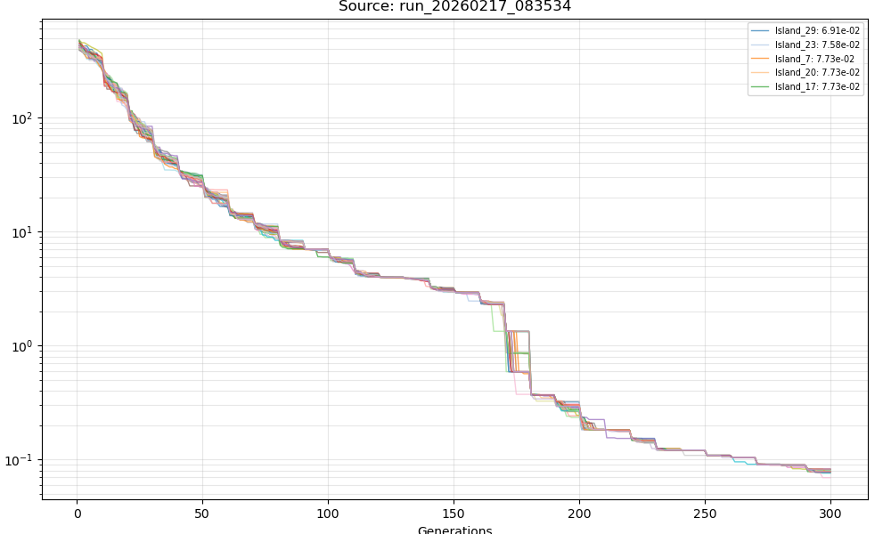
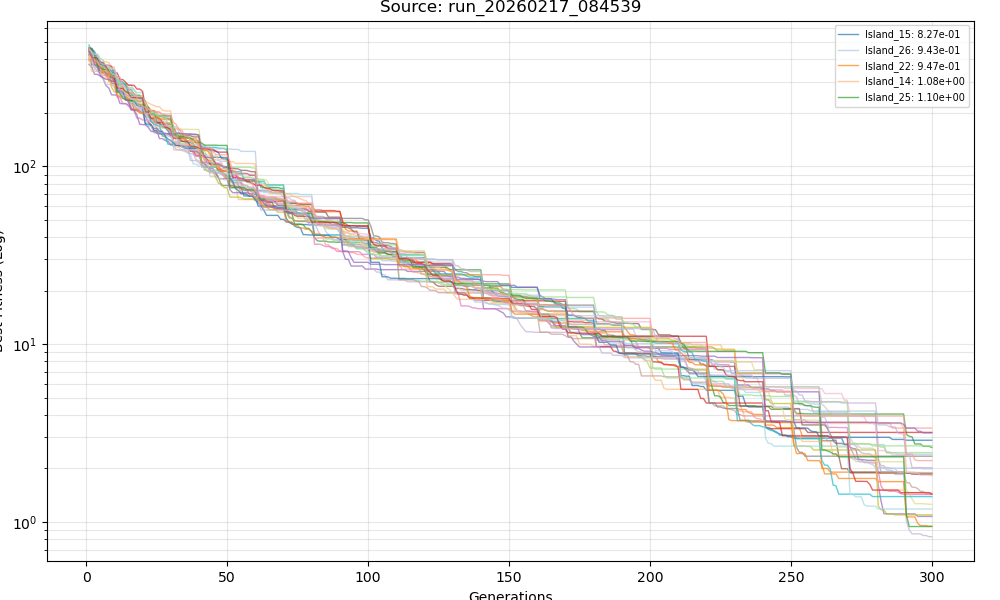

# ROS 2 Island-Model Optimisation Platform


## What is this?

## What is this?

A **ROS 2 (Jazzy)** workspace for running **island-model optimisation experiments**, implemented mainly in **C++ (rclcpp)** with a few **Python** utilities, and packaged with **Docker** for repeatable runs. It’s meant for engineers and researchers who want to **test island-model designs and assumptions early**—before a full runnable system (or simulator/robot integration) is ready.
 

## Extensibility (the core design)

The platform is designed so that the main experimental dimensions are *meant to grow*: you can scale the **number of islands (N)** without changing the core logic, and extend the **communication topology types**, **algorithm types**, and **benchmark function types** by adding new entries in the corresponding modules following the existing structure (e.g., adding tree/star graphs, adding other population-based heuristics, adding new objective functions such as double-funnel Rastrigin). In addition, the system exposes the knobs that actually define an experiment: **migration hyperparameters** (e.g., migration interval/frequency and related settings), **algorithm hyperparameters** (GA/DE/PSO-specific controls), and **benchmark difficulty parameters** (function-specific parameters and typical problem settings like dimension/bounds), so you can do controlled “what-if” tests rather than one-off runs.

## Built-in algorithms (GA / DE / PSO)

Below are **conceptual visualisations** (not runtime output) to convey the characteristic “motion” you typically see from each algorithm—useful when reasoning about heterogeneous islands.

| GA | DE | PSO |
|---|---|---|
|  |  |  |

- **GA:** looks like *discrete reshuffling* — populations jump as selection/crossover recombine building blocks, with mutation injecting novelty.
- **DE:** looks like *vector pulling* — individuals are nudged by difference vectors, often stretching and dragging the population toward promising regions.
- **PSO:** looks like *swarm flow* — particles stream and cluster around attractors (personal/global best), typically forming smooth trajectories.


---

## Quick proof on GitHub Actions

This repository contains a workflow that:
1) builds the Docker image,
2) runs a short demo configuration,
3) uploads **CSV convergence logs** as artifacts.

Go to: **Actions → demo-smoke → Run workflow**  
Then download artifact: `demo-smoke-evidence`.

Artifact includes:
- `evo_logs/run_*/Island_*.csv` (per-island per-generation best fitness)
- `launch.log` (launch stdout/stderr)
- `convergence.png` (merged plot)

---

## Results (real runs)

> If the captions are swapped, just swap the two headings below.

### FULL topology (30 islands, GA)


### RING topology (30 islands, GA)


---

## Repository layout

This repo is a ROS 2 workspace:

```
.
├─ Dockerfile
├─ docker-compose.yml
├─ src/
│   └─ island_evo_core/        # ROS 2 package
├─ assets/
│   ├─ gifs/
│   └─ results/
├─ configs/                    # demo configs
└─ tools/                      # plotting tools
```

---

## Run locally with Docker (recommended)

### Build
```bash
docker build -t island-evo:latest .
```

### Run a demo (writes CSV to ./evo_logs)

Linux/macOS/WSL:
```bash
mkdir -p evo_logs

docker run --rm -it \
  -v "$(pwd)/evo_logs:/root/ws/evo_logs" \
  -v "$(pwd)/configs:/configs:ro" \
  -w /root/ws \
  island-evo:latest \
  bash -lc 'source /opt/ros/jazzy/setup.bash && source /root/ws/install/setup.bash && timeout 60s ros2 launch island_evo_core island_system.launch.py system_config:="$(cat /configs/demo_small_full.json)" || true'
```

PowerShell (Windows):
```powershell
New-Item -ItemType Directory -Force evo_logs | Out-Null

docker run --rm -it `
  -v "$($PWD.Path)\evo_logs:/root/ws/evo_logs" `
  -v "$($PWD.Path)\configs:/configs:ro" `
  -w /root/ws `
  island-evo:latest `
  bash -lc 'source /opt/ros/jazzy/setup.bash && source /root/ws/install/setup.bash && timeout 60s ros2 launch island_evo_core island_system.launch.py system_config:="$(cat /configs/demo_small_full.json)" || true'
```

Outputs:
- `./evo_logs/run_YYYYMMDD_HHMMSS/Island_*.csv`

---

## Plot convergence (all islands in one figure)

### Realtime monitor (GUI)

Run from the same directory where `evo_logs/` is created:
```bash
python3 src/island_evo_core/scripts/generation_monitor_node.py
```

Tip: for huge runs, only plot the last N points (plotting only; CSV remains complete):
```bash
EVO_MONITOR_MAX_POINTS=2000 python3 src/island_evo_core/scripts/generation_monitor_node.py
```

### Offline merge plot (CI-friendly)
```bash
python3 tools/merge_plot.py --run-dir evo_logs/run_YYYYMMDD_HHMMSS --out convergence.png --ylog
```

---

## Configuration

Example configs are provided in `configs/`:
- `demo_small_full.json`
- `demo_small_ring.json`
- `demo_small_hetero.json`

Launch takes a JSON string:
```bash
ros2 launch island_evo_core island_system.launch.py system_config:='<JSON>'
```

Useful fields:
- `num_islands` (int)
- `topology`: `FULL` or `RING`
- `algo_allocation`: `GA_ALL` / `PSO_ALL` / `DE_ALL` or a list like `["GA","PSO","DE",...]`
- `common_params`: includes `max_generations`, `pop_size`, `migration_interval`, `enable_csv_log`

---

## Output format

When `enable_csv_log=true`, each island writes:

```
evo_logs/
  run_YYYYMMDD_HHMMSS/
    Island_0.csv
    Island_1.csv
    ...
```

CSV columns:
- `Generation`
- `Best_Fitness`

---

## License

Apache-2.0 — see `LICENSE`.
